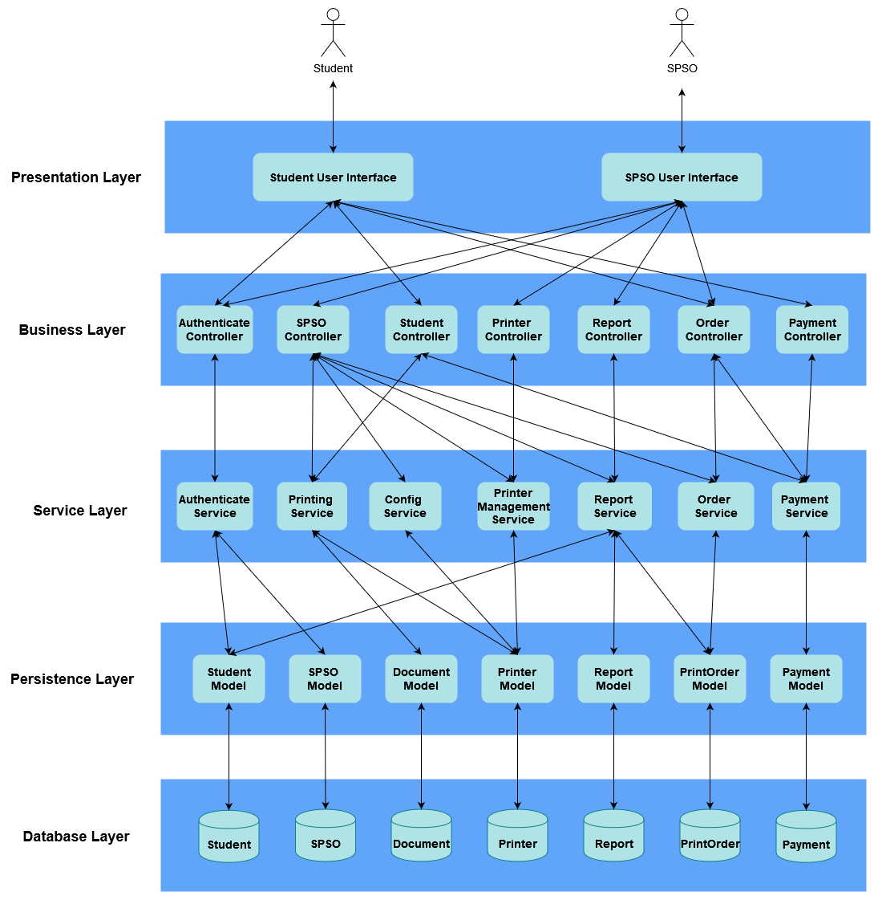
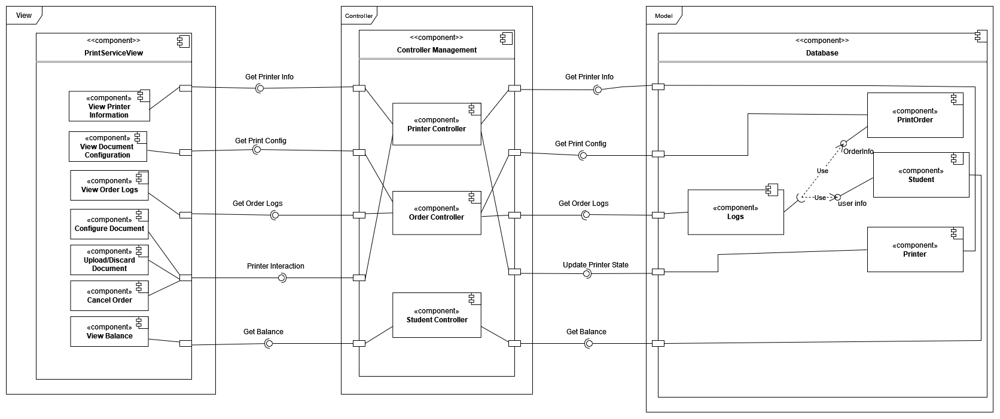
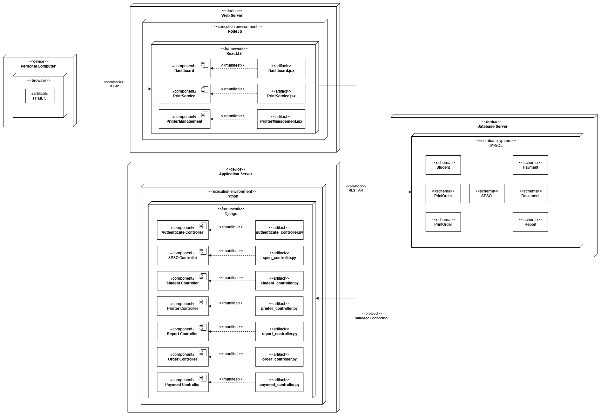

# HCMUT Student Smart Printing Service (HCMUT_SSPS)

## Project Background

### Project Origin
This is a capstone project developed by students at Ho Chi Minh University of Technology (HCMUT) to create a comprehensive student printing service system.

### Purpose
To provide an efficient, user-friendly digital printing solution that addresses the document printing needs of university students while managing printing resources effectively.

### Contributors
- Cao Ngọc Lâm - 2252419
- Đặng Minh Khang - 2252287
- Đặng Ngọc Phú - 2252617
- Đoàn Anh Quang - 2252666

## System Description

### Core Functionality
The HCMUT_SSPS is a web and mobile application designed to:
- Enable students to print documents across campus
- Manage printing resources
- Track printing activities
- Provide flexible printing options

### System Components
- Document Upload Module
- Printer Selection System
- Printing Configuration Interface
- Page Balance Management
- Printing History Tracking
- Administrative Configuration Panel

## Detailed System Specifications

### Printer Management
- Each printer has unique attributes:
  * Printer ID
  * Brand/Manufacturer
  * Printer Model
  * Description
  * Location (Campus, Building, Room)

### Printing Constraints
- Permitted file types configured by Student Printing Service Officer (SPSO)
- Printing limited by user's page balance
- Semester-based page allocation system

### Page Allocation Rules
- Default semester allocation of A4 pages
- Conversion rate: 1 A3 page = 2 A4 pages
- Option to purchase additional pages via online payment (BKPay)

### Authentication
- Mandatory authentication through HCMUT_SSO service
- Separate access levels for students and SPSO

## User Roles and Capabilities

### Students Can:
- Upload documents
- Select printers
- Configure printing properties:
  * Paper size
  * Page selection
  * One/double-sided printing
  * Copy quantity
- View personal printing history
- Purchase additional printing pages
- Check page balance

### Student Printing Service Officer (SPSO) Can:
- Manage printer infrastructure
- Add/enable/disable printers
- Configure system settings
- Modify:
  * Default page allocation
  * Allocation dates
  * Permitted file types
- Generate monthly and yearly usage reports
- View comprehensive printing logs for all students

## Project Development Methodology

### Development Stages
1. **Requirement Elicitation**
   - Domain context analysis
   - Stakeholder needs identification
   - Requirements specification

2. **System Modeling**
   - Use case diagrams
   - Activity diagrams
   - Sequence diagrams
   - Class diagrams

3. **Architecture Design**
   - Layered system architecture
   - Component diagram design
   - UI/UX strategy development

4. **Implementation Sprints**
   - MVP1: Initial user interface
   - Usability testing
   - MVP2: Refined implementation

### Technical Approach
- Iterative development
- User-centered design
- Continuous feedback integration
- Agile methodology
## System Architecture and Design

### 1. Layered Architecture


The system follows a 5-layer architecture pattern:
- **Presentation Layer**: Handles user interfaces for both Students and SPSO
- **Business Layer**: Contains controllers for different functionalities (Authentication, SPSO, Student, Printer, Report, Order, Payment)
- **Service Layer**: Implements core business logic and services
- **Persistence Layer**: Manages data models and object-relational mapping
- **Database Layer**: Stores all system data in dedicated tables

### 2. Component Interaction Diagram


The component diagram illustrates the interaction between three main parts:
- **View**: User interface components including PrintServiceView and its subcomponents
- **Controller**: Management layer handling business logic
- **Model**: Database and data structure components

Key interactions include:
- Get Printer Information
- Get Print Configuration
- Get Order Logs
- Printer Interaction
- Balance Management

### 3. System Deployment Architecture


The system is deployed across multiple servers:

#### Client Side
- Personal Computer with HTML5 Browser

#### Web Server (NodeJS)
- ReactJS Framework
- Key Components:
  * Dashboard
  * PrintService
  * PrinterManagement

#### Application Server (Python)
- Django Framework
- Controllers:
  * Authenticate Controller
  * SPSO Controller
  * Student Controller
  * Printer Controller
  * Report Controller
  * Order Controller
  * Payment Controller

#### Database Server
- MySQL Database System
- Schemas:
  * Student
  * SPSO
  * Document
  * PrintOrder
  * Payment
  * Report
## Usability Testing Strategy

### Testing Methodology
- Remote unmoderated testing
- Qualitative and quantitative evaluation
- Participant-driven refinement

### Testing Objectives
- Identify user experience challenges
- Validate interface intuitiveness
- Ensure system meets user expectations
- Continuous improvement of MVP

## Repository Structure

```
HCMUT_SSPS/
│
├── docs/
│
│
├── client/
│   ├── public/
│   └── src/
│
└── README.md
```

## Technical Requirements

### Platforms
- Web Application
### Recommended Development Tools
- Version Control: GitHub
- UI Prototyping: Figma

## Getting Started

### Prerequisites
- Development environment setup (e.g., Node.js, Python, or other relevant tools)
- GitHub account
- Familiarity with web/mobile development

### Installation Steps
1. Clone the repository
2. Install dependencies
3. Configure development environment
4. Run initial setup scripts
